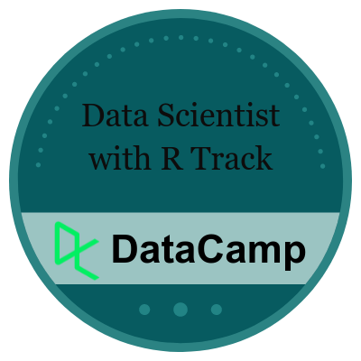
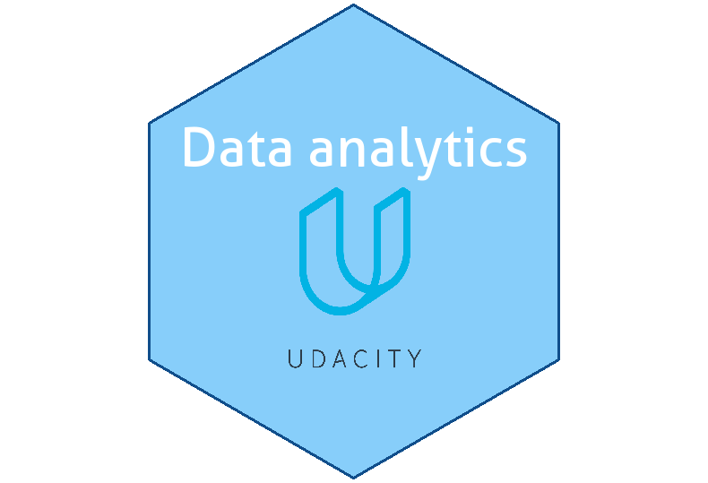

### Hi there, welcome to my github! 👋

- 🌾 I’m a PhD Candidate of Food Authenticity and Nutrition at Wageningen Univeristy & Research.

- 👨‍💻 I have been working with the Food Science and Data Science since 2017, during this time I worked with a variety of mass spectrometry, spectral analysis techniques, regression and classification models.

- 🌏 I believe that digital transformation is one of the trends in building sustainable agricultural and food systems.

### 🛠️ Coding Activity

### 📕 Certifications

- [**Data Scientist with R Track**](https://www.datacamp.com/statement-of-accomplishment/track/29dae208d30684b87e6071f27a9e4b2816407ba6?raw=1), DataCamp.
- [**Data Visualization with R Track**](https://www.datacamp.com/statement-of-accomplishment/track/b1b88592910af14b2485ea9c0d4a2570cde4e234), DataCamp.
- [**Machine Learning with *caret* in R**](https://www.datacamp.com/statement-of-accomplishment/course/904ee255e9b6a72c48006df6f3bb3a0cfdb98805), DataCamp.
- [**Data analytics (Python)**](https://graduation.udacity.com/confirm/H9LHJ5Q7), Udacity.

</a>
 </a>
</a>
</a>

