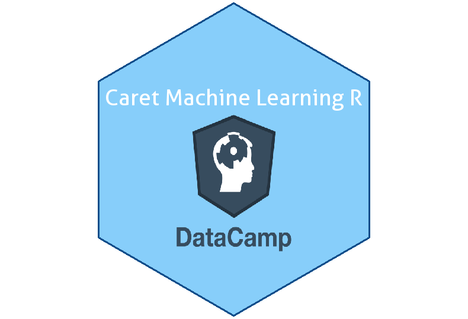

### Hi there, welcome to my GitHub! 👋

## 😄 Me:

- 🔭 I’m currently working on Food Authenticity and Nutrition.
- 🌱 I’m currently learning big data in Foods.
- 💻 I have experiences in PLS-DA, RF, ANN for hyperspectral imageing and     Mass data in foods.

## 🛠️ Coding Activity

## 📕 Certifications

 
 </a>

